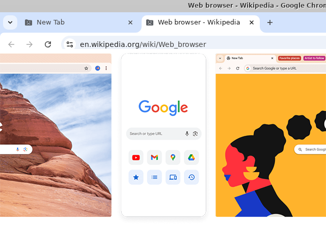

# ChromeDocker

Spin up a **throwaway Chrome inside a Docker container** and use it in your
Mac's own browser over noVNC. Nothing touches your host Chrome, Keychain, or
profile — stop the container and every trace of the session is gone.

It's a single self-contained Bash script — nothing to build or install.



> ### ⚠️ Compatibility — read this first
>
> - **macOS only** (drives your Mac browser + Colima/Docker Desktop).
> - **Apple Silicon (M1/M2/M3):** works out of the box.
> - **Intel Macs:** you **must** use the **QEMU** VM backend, or Chrome's renderer
>   crashes with `Aw, Snap! (SIGSEGV)` on real pages. The default Colima `vz`
>   backend can't run Chrome's JIT correctly under an Intel hypervisor. This
>   script sets `COLIMA_VMTYPE=qemu` for you — just install it once with
>   **`brew install qemu`** (see [Troubleshooting](#aw-snap--cant-open-this-page-sigsegv)).
> - **Docker Desktop users:** the VM-backend fix is Colima-specific; if you hit
>   the same crash on Docker Desktop, enable a software/QEMU-style VM or switch to
>   Colima + QEMU.

---

## What This Tool Does

The World Wide Web promises a lot of things, but your privacy is not one of
them — your data is **not** secure. Every site you touch is quietly building a
picture of you: browser fingerprinting stitches together your screen size,
fonts, timezone, GPU, and dozens of other signals into an identifier that
follows you even with cookies cleared and a VPN on. Cookies, trackers, cached
logins, and leftover extensions all bleed state between sessions and hand it
straight to advertisers, data brokers, and anyone snooping in between. Your
normal browser remembers everything, and so does everyone watching it.

ChromeDocker flips that on its head. It's a brand-new, sandboxed Chrome that
leaves **zero footprint** on your real machine — a throwaway session with no
history to mine and nothing to leak back to your daily profile. That's useful
for a lot more than it first sounds:

- **Private / clean browsing** — a genuinely fresh profile with no cookies,
  history, extensions, or saved logins bleeding in from your daily browser.
  Close it and it's gone.
- **Crypto & MetaMask** — keep wallet extensions and dApp sessions fully
  isolated from your everyday browsing, so a compromised site or extension on
  your main profile can't reach them (and vice-versa). Destroy the container to
  wipe the session cleanly.
- **Security / SecOps work** — open suspicious links, phishing pages, or
  untrusted downloads inside a disposable container instead of on your host.
  Blast radius is the container, not your Mac.
- **Account isolation** — run a separate work, client, or throwaway Google
  account without profile-juggling or signing in and out.
- **Gaming & web apps** — a clean, dedicated session for browser games or
  web apps that you don't want tangled up with your main profile's cookies.
- **Shared / public machines** — spin up a private session on a library,
  lab, or shared computer and leave nothing behind when you stop it.
- **Testing & development** — a pristine browser for reproducing bugs,
  testing extensions, or checking a site with none of your own state cached.

---

## Quick start

```bash
bash chromedocker.sh          # start (or reattach if already running)
bash chromedocker.sh stop     # kill the container — everything inside is destroyed
bash chromedocker.sh restart  # stop + fresh start
bash chromedocker.sh status   # is it running?
bash chromedocker.sh down     # stop container AND shut down the Colima VM
```

Once it's up, the container's Chrome opens at **https://localhost:6901**
(self-signed cert — click through the browser warning).

Login: user `kasm_user`, password `password`.

### In action

```console
$ bash chromedocker.sh
==> Pulling kasmweb/chrome:1.16.0 (skips if cached)...
==> Starting throwaway Chrome container...
==> Waiting for Chrome UI on https://localhost:6901.
================================================================
  Throwaway Chrome is up:  https://localhost:6901
  Login:  kasm_user  /  password
  (Self-signed cert: click through the browser warning.)

  Stop & destroy:  bash chromedocker.sh stop
================================================================
```

---

## How it works

- Runs the [`kasmweb/chrome`](https://hub.docker.com/r/kasmweb/chrome) image,
  which packages Chrome + a noVNC server.
- Binds the noVNC UI to **`127.0.0.1:6901` only** — not exposed to your network.
- Starts the container with `--rm`, so stopping it destroys the container and
  everything inside (profile, cookies, history, downloads).
- Auto-starts a Docker daemon if one isn't running — preferring
  [Colima](https://github.com/abiosoft/colima), falling back to Docker Desktop.

---

## Configuration

Edit the variables at the top of the script:

| Variable | Default | Meaning |
| --- | --- | --- |
| `IMAGE` | `kasmweb/chrome:1.16.0` | Container image / Chrome version |
| `PORT` | `6901` | Local port the noVNC UI is bound to (127.0.0.1 only) |
| `VNC_PW` | `password` | noVNC login password |
| `SHM` | `512m` | Shared-memory size for Chrome |
| `COLIMA_CPU` / `COLIMA_MEM` | `4` / `6` | Colima VM sizing (only if Colima isn't already running) |

The script also launches the container with `--security-opt seccomp=unconfined`
and GPU-disabling Chrome flags (`APP_ARGS`) — see Troubleshooting for why.

---

## Troubleshooting

### "Am I looking at the container, or my real browser?"

You view the container's Chrome _inside_ a tab of your own Mac browser, so it's
easy to lose track of which one you're driving. The reliable tell is your **host
browser's address bar** (the outer one, at the very top of the window):

| | Your real browser (host) | The container (Kasm) |
| --- | --- | --- |
| Host address bar | the real site, e.g. `youtube.com` | always **`localhost:6901`** |
| Host tab title | the page's name | includes **`(kasm-user)`** + a container ID |
| Address bars on screen | one | **two** — the host's, then a second one _inside_ the page |
| Your logins / bookmarks | present | empty, logged-out, fresh |

**Rule of thumb:** while the host address bar reads `localhost:6901`, everything
below it is the sandbox. The moment it shows a real site name, you've clicked out
into your normal browser — and anything you do there uses your real logins.

### `Aw, Snap!` / `Can't open this page` (`SIGSEGV`)

Chrome's renderer crashes on real pages (apple.com, Google search, YouTube),
often after a page or two. This is **not** a shared-memory problem — bumping
`SHM` does not help.

**Root cause:** on Intel Macs, Colima's default `vz`
(Apple Virtualization.framework) backend doesn't fully support the CPU
instructions Chrome's V8 **JIT** compiler emits, so the renderer segfaults. (On
older macOS you may even see Colima warn that `vz` needs a newer macOS.)

**Fix (what this script now does): run the Colima VM on the QEMU backend**,
which fully emulates the CPU. Set in the script via `COLIMA_VMTYPE=qemu`. It
requires QEMU on the host:

```bash
brew install qemu          # one-time (builds from source on Intel — can take a while)
bash chromedocker.sh down  # tear down the old VM
colima delete -f           # remove the old vz VM
bash chromedocker.sh       # starts a fresh QEMU VM + container
```

With QEMU, JIT **and** WebAssembly work normally, so MetaMask and crypto dApps
are fine. Trade-off: QEMU is a bit slower than `vz` at runtime.

The container is also started with `--security-opt seccomp=unconfined` and
GPU-disabling `APP_ARGS` (belt-and-suspenders for the virtualised environment);
leave those in place.

> **Quick workaround (no VM rebuild):** adding `--js-flags=--jitless` to
> `CHROME_FLAGS` also stops the crash by disabling the JIT — but it **disables
> WebAssembly**, so MetaMask / some dApps break. Prefer the QEMU fix above.

### The container's Chrome is logged out / doesn't have my extensions

That's by design — it's a fresh, isolated profile with none of your host state.
Stopping the container wipes it. That isolation is the whole point of the tool.

---

## Requirements

- macOS
- Docker, via **Colima** (`brew install colima docker`) **or** Docker Desktop
- **Intel Macs:** also `brew install qemu` — the script runs Colima on the QEMU
  backend to avoid Chrome renderer crashes (see Troubleshooting)

The first run pulls the `kasmweb/chrome` image (~2 GB), so give it a minute.
Subsequent starts are fast.

---

## Notes

- The self-signed TLS cert on `localhost:6901` is expected — click through the
  warning once.
- `down` also stops the Colima VM, freeing the CPU/RAM it reserved. Use it when
  you're done for the day; use `stop` if you'll spin Chrome up again shortly.

<br />
<br />

<div align="center">
  <a href="https://techangelx.com" target="_blank">
    
  </a>
  <br /><br />
  <span style="font-size: 1.4em; font-weight: 300;">
    Built by Ricki Angel • <a href="https://techangelx.com" target="_blank" style="text-decoration: none;">Tech Angel X</a>
  </span>
</div>
